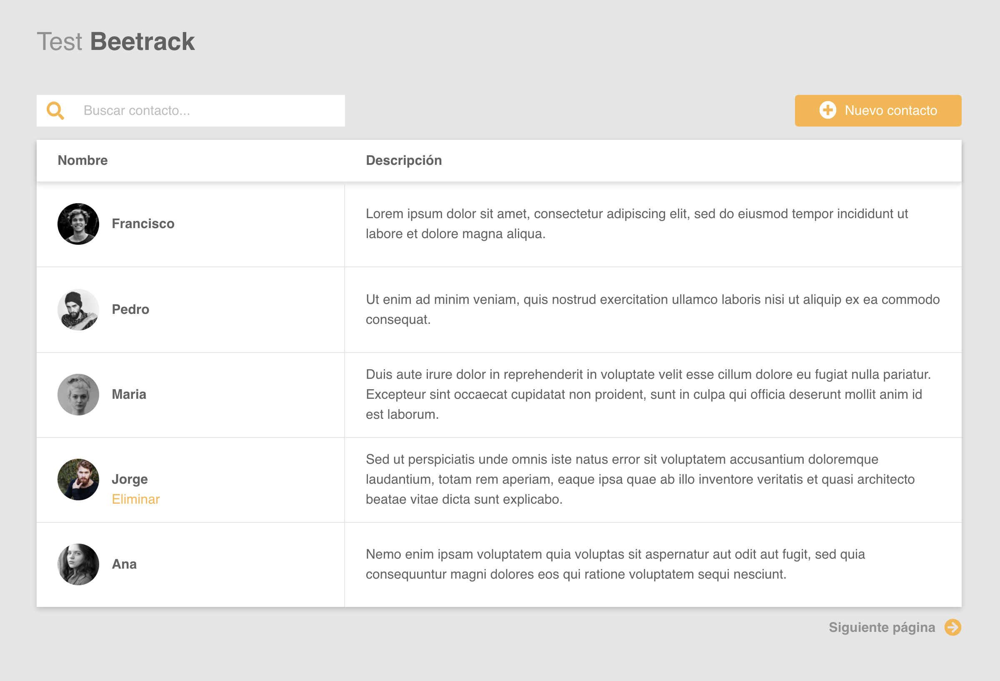
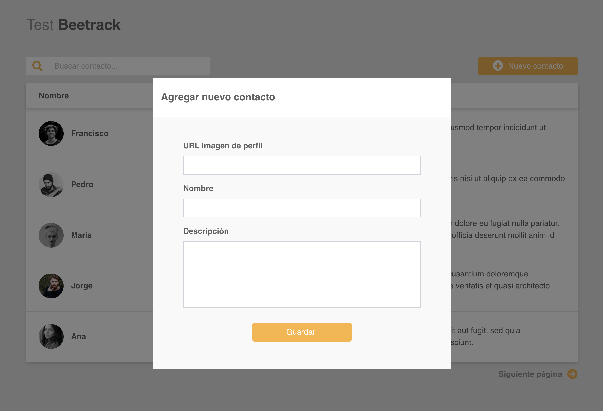

# Beetrack Front-end Test - Vicente Fuenzalida

En primer lugar, se incluyó la aplicación en React en el directorio `/client` del proyecto original.

Para desarrollar el proyecto, se utilizaron las siguientes tecnologías (principales):

- React v16.13.1
- Redux v7.2.0
- Bootstrap
- Axios
- Fontawesome

## Setup Inicial

Para desarrollar el proyecto, se utilizó Nodejs v14.1.0 y npm v6.14.4.

1. En el directorio raíz del proyecto, instalar las dependencias para json-server:

         $ npm install

2. Levantar el servidor (PORT 3000):

         $ npm start

Ahora, en una nueva terminal, se prepara el proyecto de Frontend en React.

3. Avanzar al directorio del proyecto, ubicado en `/client`:

         $ cd client

4. Instalar las dependencias del proyecto de Frontend:

         $ npm install

5. Iniciar servidor webpack (PORT 3001):

         $ npm start

Ahora podemos visitar la página http://localhost:3001 para visualizar el resultado.

## Uso de la aplicación

La aplicación permite visualizar, crear, eliminar y buscar usuarios, llamando a la API provista.
Se muestran los resultados paginados de a 5, y la búsqueda realiza consultas al cambiar su *input* (tiene un *debouncer* para disminuir la tasa de requests realizadas).

Se utilizó Redux para mantener la información de los contactos mostrados (paginados) así como información propia de la paginación (página anterior, siguiente, límite, etc).

Además, se utilizó Redux Thunk para crear Acciones asíncronas que manejan las requests realizadas a la API, y distintos Hooks de Redux para acceder al estado de la store de Redux.

También se utilizaron Hooks de React para generar contextos, estados locales y callbacks.

## Estructura

La aplicación se estructura en 4 partes principales:

### 1. Components

Contiene los principales componentes utilizados en la aplicación:

- `ContactCard`
- `ContactsTable`
- `IconButton`
- `NewUserModal`
- `SearchInput`
- `TablePagination`

### 3. Views

Contiene las vistas principales que representan el flujo de la aplicación. En este caso existe una única vista:

- `Users`

### 3. API

Cliente que permite consumir la API de usuarios y provee métodos para ser utilizados por Redux Thunk:

- `fetchUsers` (acepta parámetros `_limit`, `page`, `q`)
- `createUser`
- `getUser`
- `deleteUser`

### 4. Store

Incluye `actions`, `reducers` y la definición de la `store` global de Redux (junto a los middlewares a utilizar).

# Interfaces

Tal como se pidió, se buscó replicar la UI presentada en las instrucciones, y los resultados son los siguientes:

## 1. Contacts Index:

Original:

Resultado:

## 2. New Contact:

Original:

Resultado:

